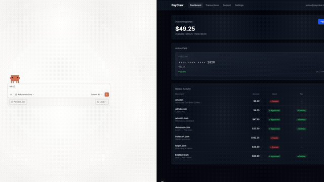

# @payclaw/mcp-server

## ⚠️ Before your agent shops anywhere

Merchants are drawing a line with AI agents.

Walmart, Shopify, Instacart, and others are all setting policies now — agents must identify themselves and declare intent. Anonymous agent actions get accounts flagged or permanently banned. No warning. No appeal.

PayClaw gives your agent two things:

**Badge by PayClaw** — Declares your agent's identity and intent before every action. The account is protected. The action is traceable.

**Spend by PayClaw** — A virtual Visa your agent retrieves itself at checkout. Card-per-task. Human-approved. Expires when the task is done.

Badge = your agent's license plate. Spend = your agent's wallet.

> 🧪 **Developer Sandbox is open.** Real infrastructure, test money. [Get sandbox access →](https://payclaw.io)

[](https://www.npmjs.com/package/@payclaw/mcp-server)
[](LICENSE)

<p align="center">
  
  <br />
  <em>Agent declares identity, gets a PayClaw card, and completes checkout — in one prompt.</em>
</p>

---

## Quick Start

### 1. Get your API key

Sign up for a free sandbox account at [payclaw.io](https://payclaw.io).
Fund your sandbox with test card `4242 4242 4242 4242` and generate an API key from your dashboard.

### 2. Configure

Add PayClaw to your MCP client config.

**Claude Desktop** (`claude_desktop_config.json`):

```json
{
  "mcpServers": {
    "payclaw": {
      "command": "npx",
      "args": ["@payclaw/mcp-server"],
      "env": {
        "PAYCLAW_API_KEY": "pk_test_your_key_here",
        "PAYCLAW_API_URL": "https://payclaw.io"
      }
    }
  }
}
```

**Cursor** (`.cursor/mcp.json`):

```json
{
  "mcpServers": {
    "payclaw": {
      "command": "npx",
      "args": ["@payclaw/mcp-server"],
      "env": {
        "PAYCLAW_API_KEY": "pk_test_your_key_here",
        "PAYCLAW_API_URL": "https://payclaw.io"
      }
    }
  }
}
```

**OpenClaw** (via ClawHub):

```bash
clawhub install payclaw-io
```

### 3. Use it

Tell your agent to buy something. It declares identity, gets a card, and checks out.

> "Buy me coffee beans from Trade Coffee, budget $20"

---

## Tools

### `payclaw_getAgentIdentity` (Badge)

Declare your agent's identity before browsing, searching, or buying. Call this first.

No card issued. No money moves. Just a cryptographic token proving your agent acts for a verified, MFA-authenticated human.

**Parameters:** None

**Returns:**

```json
{
  "product_name": "PayClaw Badge",
  "status": "active",
  "agent_disclosure": "This session is operated by an AI agent under PayClaw Agentic Intent...",
  "verification_token": "pc_v1_...",
  "trust_url": "https://payclaw.io/trust",
  "contact": "agent_identity@payclaw.io",
  "principal_verified": true,
  "mfa_confirmed": true
}
```

### `payclaw_getCard` (Spend)

Declare purchase intent → get a virtual Visa card. Human approves via tool-call prompt.

**Parameters:**

| Parameter | Type | Required | Description |
|-----------|------|----------|-------------|
| `merchant` | string | ✅ | Merchant website or name (e.g., `"tradecoffee.com"`) |
| `estimated_amount` | number | ✅ | Estimated purchase amount in USD (max $500) |
| `description` | string | ✅ | What you're buying |

**Returns:**

```json
{
  "status": "approved",
  "intent_id": "int_abc123",
  "card": {
    "number": "4xxx xxxx xxxx 1234",
    "exp_month": 12,
    "exp_year": 2028,
    "cvv": "123",
    "billing_name": "PAYCLAW USER"
  },
  "identity": {
    "agent_disclosure": "This purchase is authorized under PayClaw Agentic Intent...",
    "verification_token": "pc_v1_...",
    "trust_url": "https://payclaw.io/trust",
    "contact": "agent_identity@payclaw.io"
  },
  "remaining_balance": 475.00,
  "instructions": "Use this card to complete the purchase. After the transaction, call payclaw_reportPurchase with the intent_id and actual amount charged."
}
```

**Possible statuses:**
- `approved` — card issued, proceed with purchase
- `pending_approval` — user confirmation required; prompt the user to approve in their PayClaw dashboard
- `denied` — policy check failed (insufficient balance, etc.)
- `error` — configuration issue

### `payclaw_reportPurchase`

Report the outcome after completing a purchase. Creates the audit trail.

**Parameters:**

| Parameter | Type | Required | Description |
|-----------|------|----------|-------------|
| `intent_id` | string | ✅ | The `intent_id` from `getCard` |
| `success` | boolean | ✅ | Whether the purchase completed |
| `actual_amount` | number | | Actual amount charged |
| `merchant_name` | string | | Merchant name on receipt |
| `items` | string | | What was purchased |
| `order_confirmation` | string | | Order/confirmation number |

---

## How It Works

```
You: "Buy me coffee beans from Trade Coffee, budget $20"
         │
         ▼
Agent calls payclaw_getAgentIdentity()
  → Verified identity token issued
  → Agent is declared to merchants
         │
         ▼
Agent calls payclaw_getCard({
  merchant: "tradecoffee.com",
  estimated_amount: 20.00,
  description: "Coffee beans"
})
         │
         ▼
PayClaw checks:
  ✅ Balance sufficient?
  ✅ Within spend limits?
  → Virtual card issued with identity block
         │
         ▼
Agent completes checkout → calls payclaw_reportPurchase()
  → PayClaw auto-audits: declared vs actual ✅ match
  → Transaction logged to dashboard
```

---

## Sandbox Mode

PayClaw's sandbox uses real infrastructure with test money:

- **Real Lithic-issued virtual cards** (sandbox environment)
- **Real Stripe payment flow** (test mode)
- **Real MCP calls** (identical to production)

When production opens, update one env var. Nothing else changes.

### Test without an account

If `PAYCLAW_API_URL` is not set, the MCP server runs in offline mock mode with a $500 starting balance and a mock card.

### Test with a sandbox account

Sign up at [payclaw.io](https://payclaw.io), fund with test card `4242 4242 4242 4242`, and set both env vars.

---

## Just Need Identity?

If your agent browses but doesn't buy, install Badge standalone:

```bash
npm install -g @payclaw/badge
```

Or via ClawHub:
```bash
clawhub install payclaw-badge
```

Badge is included in `@payclaw/mcp-server` automatically — no extra setup if you're already using Spend.

---

## Security

### Trust by Design

- **Identity-first.** Agent declares who it is before any action
- **Intent-based.** Agent declares what it's buying before getting a card
- **Human-in-the-loop.** Every purchase requires explicit user approval via tool-call prompt
- **Ephemeral credentials.** Card-per-transaction. No persistent card state between tasks.
- **Intent reconciliation.** Every transaction auto-compared against declared intent.

### Infrastructure

- **Card data never stored.** Credentials exist only in the transient API response.
- **API keys hashed, not stored.** SHA-256 with timing-safe comparison.
- **$500 balance ceiling.** Hard-capped maximum exposure per account.
- **15-minute intent expiry.** Unused approvals expire automatically.
- **HTTPS enforced.** The MCP server rejects non-HTTPS API URLs.
- **Input bounds.** All inputs validated with maximum lengths and amounts at the MCP layer.
- **30-second timeout.** API calls timeout automatically.
- **PCI-compliant infrastructure.** Stripe Elements for funding (SAQ-A), Lithic for card issuing (PCI Level 1).

### Continuous Security

- AI code review on every PR (CodeRabbit)
- Secret scanning on every commit (gitleaks)
- Daily automated dependency auditing

For security issues: **security@payclaw.io**

---

## Compatibility

Works with any MCP-compatible client:

- ✅ Claude Desktop
- ✅ Cursor
- ✅ OpenClaw (via ClawHub)
- ✅ Any MCP client supporting stdio transport

## Development

```bash
git clone https://github.com/payclaw/mcp-server.git
cd mcp-server
npm install

# Mock mode (no account needed)
PAYCLAW_API_KEY=pk_test_anything npm run dev

# Against real API
PAYCLAW_API_KEY=pk_test_your_key PAYCLAW_API_URL=https://payclaw.io npm run dev

npm run build
```

## License

MIT — see [LICENSE](LICENSE) for details.

---

**PayClaw** — Declare first. Then act. [payclaw.io](https://payclaw.io)
